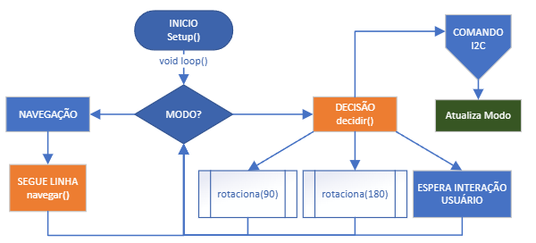
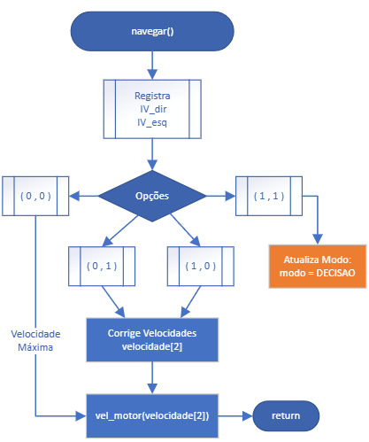
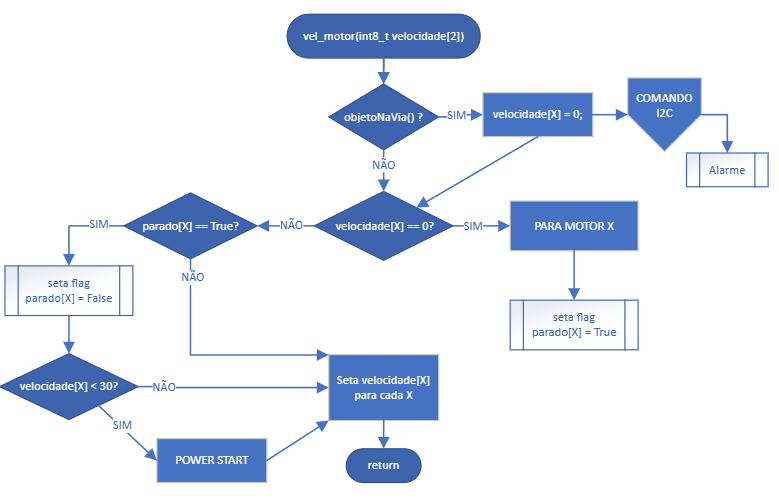

# Robô seguidor de linha 

***GRUPO 11***  

**PUC CAMPINAS - TURMA 2021**

Curso: ***Engenharia de Controle e Automação***

---

## Sobre esta pasta

Esta é uma pasta pertencente ao projeto [Robô Seguidor de Linha](../../Seguidor_de_linha/). 

O projeto contém dois controladores. O controlador do Robô, com seus sensores, baseado no Arduino UNO (esta pasta) e outro com a placa do BitDogLab, que já vem com vários periféricos e é baseada no controlador Raspberry Pi Pico (na pasta [bitDogLab](../bitDogLab/))

gbas A placa BitDogLab é responsável pelo gerenciamento dos comandos e interface do usuário. 

A comunicação entre as placas se dá através do protocolo I2C.

---

**Integrantes do grupo**
- *Carlos Amaral*
- *Gabriel Morelli*
- *Guilherme Talmann*
- *Murilo Scandiuza* 

---

## Descrição da lógica de programação no Arduino:
O arduino será responsável pelo controle de movimentação do carrinho seguidor de linha. **Ele deverá:**
- Rodar 360o se chegar ao fim da linha, ou se o destino for para o lado oposto em que está se dirigindo
- Parar e aguardar um período determinado (STALL_TIME) se encontrar com um ponto de espera
- Girar para o lado correspondente se chegar em uma 'esquina' 
- Parar e aguardar se um obstáculo ficar em seu caminho, emitindo um som e piscando uma luz, para que a pessoa saia da frente
- Receber comandos da BitDogLab:
  - Manter parado, pois há alguém configurando o robô
  - Se dirigir diretamente para o ponto de espera informado
  - Retornar a ronda depois que o usuário já retirou o despachado do recipiente 

## Decisões autônomas:
O robô terá que identificar *os pontos de espera*, *os pontos de retorno 360o*, *se ajustar ao trajeto* da linha, e o *ponto de rotação 90o* para direita ou para esquerda. Todas essas identificações terão que ser realizadas apenas com os dois sensores infravermelhos de baixo do carrinho. 
Para isso funcionar, vamos utilizar dois estados de sensoramento:
- Estado de Navegação
- Estado de Decisão

### Estado de Navegação
Neste estado o robô segue a linha escura. Os quatro estados representam os seguintes comandos:
| Configuração dos Sensores | Comando                | Significado                       |
|:-------------------------:|------------------------|-----------------------------------|
|       ( 1  -  0 )         | segue virando para dir | Linha encostando no sensor da esq |
|       ( 0  -  1 )         | segue virando para esq | Linha encostando no sensor da dir |
|       ( 0  -  0 )         | seguir em frente       | Linha está no meio                |
|       ( 1  -  1 )         | muda de estado         | **Código para trocar de estado**      |

### Estado de Decisão
Neste estado o robô segue vagarosamente para frente até registrar o(s) comando(s) e receber novamente o código de troca de estado. Apenas nesse momento é que ele executa o comando.
| Configuração dos Sensores | Comando                | Significado                       |
|:-------------------------:|------------------------|-----------------------------------|
|       ( 1  -  0 )         | Gira 180o              | Fim da linha, retornar            |
|       ( 0  -  1 )         | Parada no posto        | Aguarda interação com usuario |
|       ( 0  -  0 )         | gira 90o               | aguarda próximo comando           |
|                           |      ( 1  -  0 )                  | P/ esq                            |
|                           |      ( 0  -  1 )                  | P/ dir                            |
|       ( 1  -  1 )         | muda de estado         | **Código para trocar de estado**      |

O processo genérico pode ser representado no diagrama a seguir. O *Comando I2C* é a ponde de integração entre o Arduino e o Raspberry Pi Pico, que controla a interface de interação do usuário através do [***BitDogLab***](../bitDogLab/). 

Os Diagramas a seguir mostram o detalhe do fluxograma para controle das navegação do carrinho (controle das rodas).

Os Diagramas seguintes se referem ao controle de Decisão.

(A COMPLETAR)

---

## Licença

GPL-3.0